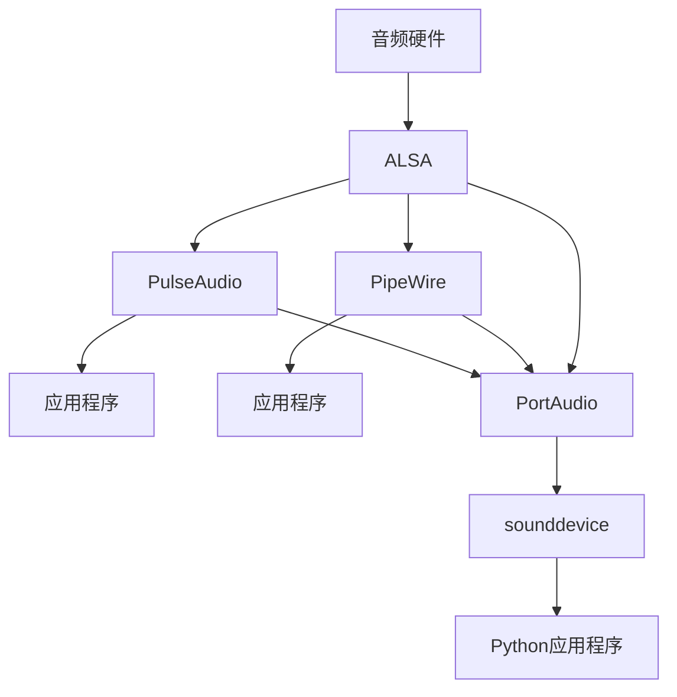
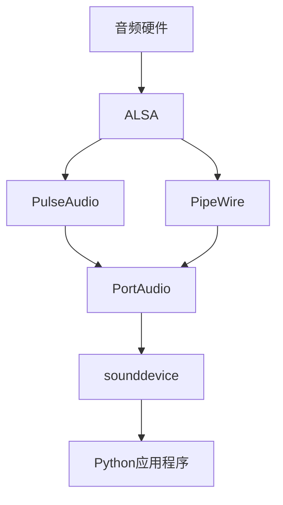

# PulseAudio、PipeWire、ALSA、PortAudio和sounddevice之间的关系

## PulseAudio、PipeWire、ALSA、PortAudio和sounddevice之间的关系-0

这些技术都与音频系统相关，但在音频栈的不同层级工作，形成了一个层次结构：

## 基础层级关系

## 具体解释

### ALSA (Advanced Linux Sound Architecture)

- **最底层**的Linux音频系统
- 直接与**硬件交互**的内核组件
- 提供基础的音频驱动和API
- 功能相对基础，不擅长处理多应用程序同时使用音频设备的情况

### PulseAudio

- 建立在ALSA之上的**音频服务器**
- 作为中间层，允许多个应用程序共享音频设备
- 提供混音、音量控制、网络音频等高级功能
- 长期以来是Linux桌面环境的标准音频系统

### PipeWire

- **PulseAudio的现代替代品**
- 设计目标更广泛，同时处理音频和视频流
- 提供更低延迟和更好的专业音频支持
- 兼容PulseAudio、JACK和ALSA应用程序
- 正在逐渐取代许多Linux发行版中的PulseAudio

### PortAudio

- **跨平台音频API**
- 抽象底层音频系统，可以使用多种后端：
    - Linux上可以使用ALSA、PulseAudio或PipeWire
    - Windows上使用WASAPI或DirectSound
    - macOS上使用CoreAudio
- 允许开发者编写一次代码，在不同平台上运行

### sounddevice

- Python库，是**PortAudio的Python绑定**
- 允许Python程序员使用PortAudio的功能
- 间接地可以通过PortAudio访问所有底层音频系统

## 工作方式

1. 应用程序通常连接到PulseAudio或PipeWire
2. PulseAudio/PipeWire处理混音和路由
3. 经过处理后的音频通过ALSA发送到硬件

跨平台应用程序更偏向于使用PortAudio，它会根据系统环境自动选择合适的后端（如ALSA、PulseAudio或PipeWire）。

## 历史演进

ALSA → PulseAudio → PipeWire 代表了Linux音频系统的发展方向，每一代都解决了前一代的一些局限性。目前许多Linux发行版正在从PulseAudio过渡到PipeWire。

## PulseAudio、PipeWire、ALSA、PortAudio和sounddevice之间的关系-1

通过分析代码文件，我可以详细解释这些音频技术之间的层次关系：

## 整体结构（由底至上）

## 各层详解

### 1. ALSA (Advanced Linux Sound Architecture)

- **位置：** 最底层，直接与硬件交互
- **功能：** 提供Linux系统的基础音频驱动程序接口
- **代码体现：** 在`check_audio_bluetooth.py`中通过`check_alsa_devices()`函数使用`aplay -l`和`arecord -l`命令检查ALSA设备

### 2. PulseAudio/PipeWire (音频服务器)

- **位置：** 中间层，建立在ALSA之上
- **功能：**
    - 提供混音、路由和设备管理
    - 允许多个应用程序共享音频设备
    - PipeWire是PulseAudio的现代替代品，兼容性更好，功能更强大
- **代码体现：**
    - `check_pulseaudio()`函数检查PulseAudio状态和设备
    - `check_pipewire()`函数检查PipeWire状态和设备
    - 通过系统命令如`pactl list sources`和`pw-cli list-objects`获取详细信息

### 3. PortAudio (跨平台API)

- **位置：** API抽象层
- **功能：** 提供跨平台音频API，可以使用ALSA、PulseAudio或PipeWire作为后端
- **代码体现：** 通过`sd.get_portaudio_version()`显示PortAudio版本

### 4. sounddevice (Python库)

- **位置：** 最上层，应用程序接口
- **功能：** PortAudio的Python绑定，允许Python程序访问音频功能
- **代码体现：** 两个脚本都使用`import sounddevice as sd`，通过`sd.query_devices()`等函数获取设备信息

## 实际工作流程

1. Python应用程序调用sounddevice库函数
2. sounddevice通过PortAudio API访问底层音频系统
3. PortAudio根据系统配置选择合适的后端(ALSA/PulseAudio/PipeWire)
4. 如果使用PulseAudio/PipeWire，它们会处理混音和路由
5. 最终，音频数据通过ALSA传递给硬件设备

示例代码中的`check_audio_bluetooth.py`展示了如何检查每一层的状态，这对于排查音频问题特别有用，因为问题可能出现在任何一个层级。
